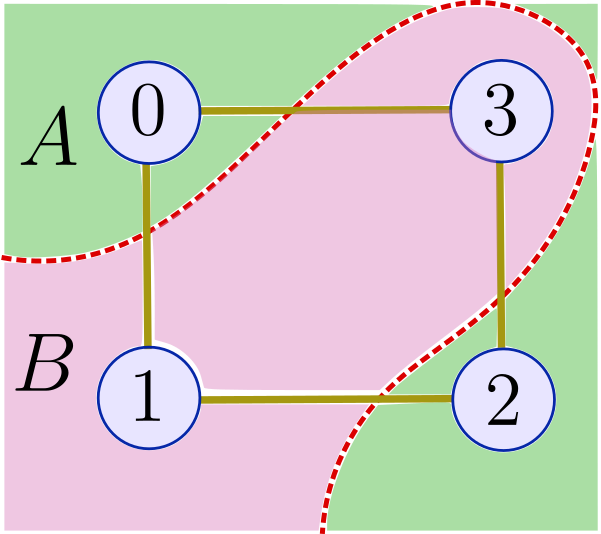
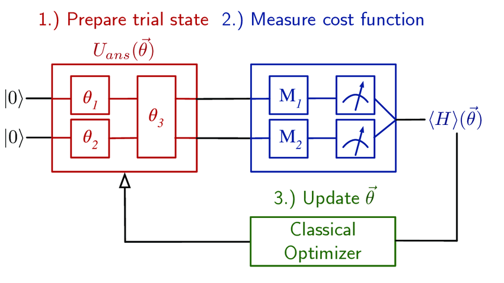

# Event Scheduling using Max Cut

## The problem statement

There is an event scheduling organization who has events on weekends. All of the events are a day long, so it is not possible for a participant to attend more than one event in a day. To maximize the attendance, the company has asked all the participants to submit their preferences for which two events they wish to attend. Our task is to schedule the events such that it maximizes the participation based on the preferences.

To solve the above problem, I have implemented the VQE algorithm in Qiskit. Refer to [this notebook](https://github.com/jashgopani/maxcut-vqe/blob/main/maxcut_vqe.ipynb) for the code for the same.

## VQE diagram

## Setup instructions

The setup instructions are specified in the `maxcut_vqe.ipynb` file.

## Tech stack

